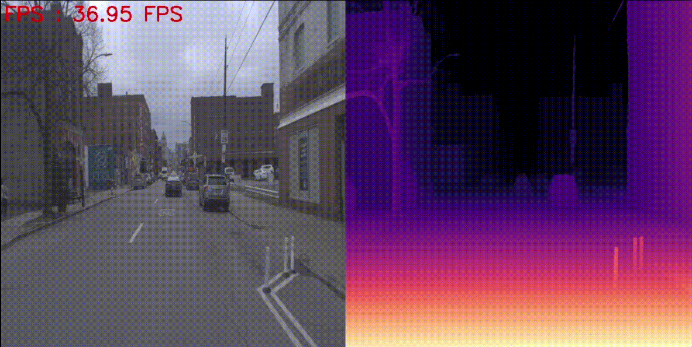

# Depth Anything V2 - TensorRT 擴充版

本專案是基於原始 [Depth Anything V2](https://github.com/DepthAnything/Depth-Anything-V2) 所延伸，**新增支援 ONNX / TensorRT 的壓縮與影片推論功能**，可更高效地部署於 GPU 加速推論場景中。

> 🎥 支援即時影片輸入推論（Webcam 或 MP4）
> ⚙️ 支援 PyTorch → ONNX → TensorRT 引擎轉換流程
> 🚀 支援 FP32 / FP16 模式選擇與自動化權重轉換

---

## 📁 專案結構與主要程式說明

| 檔案名稱       | 說明 |
|----------------|------|
| `demo_onnx.py` | 最基礎推論腳本，支援載入原始 PyTorch 或 ONNX 權重模型，並可進行 ONNX / TensorRT 引擎壓縮。 |
| `trt.py`       | 以 TensorRT engine 執行的高效率推論腳本，使用 PyCUDA 進行記憶體與流控制管理。 |
| `export.py`    | 專門用來匯出模型為 ONNX 並建立 TensorRT 引擎，支援 FP16 / FP32 模式。 |
| `demo_trt.py`  | 綜合推論腳本（正在整合中），目標是整合原始模型 → ONNX → TensorRT 並支援影片推論與自動建構流程。 |

---
## 📊 模型推論效能比較 (FPS)
**🟠 原始 PyTorch 模型（vit-s）**


**🟡 ONNX 模型推論（vit-s）**


**🔵 TensorRT FP32 推論（vit-s）**


**🟢 TensorRT FP16 推論（vit-s）**


---
## 🎬 推論效果預覽

|模型架構       | 原始 PyTorch | ONNX | TensorRT FP32 | TensorRT FP16 |
|---------------|------|------|------|------|
| `vit-s`       |40–41 FPS|66–68 FPS|71–76 FPS|76–82 FPS |
| `vit-b`       |22–23 FPS|33–35 FPS|37–39 FPS|90–100 FPS|
| `vit-ly`      | 9–10 FPS|13–14 FPS|13–14 FPS|55–58 FPS |

---
## 💻 系統環境資訊 (環境建議)

| 套件名稱       | 版本 |
|---------------|------|
|Python|3.10.0|
|PyTorch|2.5.1+cu121|
|TorchVision|0.20.1+cu121|
|Torchaudio|2.5.1+cu121|
|TensorRT|10.10.0.31|
|ONNX|1.17.0|
|ONNXRuntime-GPU|1.21.1|
---
## 🧠 模型權重下載

請至以下 Google Drive 下載對應的模型與 TensorRT 引擎檔案：

🔗 [Depth Anything V2 Weights - Google Drive](https://drive.google.com/drive/folders/1FIeJFCWv2RBRNA9CVut9nqfSIA7yKgyH?usp=drive_link)

建議將下載後的檔案放置於 `./checkpoints` 目錄下。

---

## 🚀 推論流程快速開始

### 🔹 使用 ONNX 推論 / 建立.onnx and .engine weights：
```bash
python demo_onnx.py \
  --encoder vitb \
  --trt True \
  --precision fp16 \
  --video_path ./videos/test.mp4
  
```

### 🔹 使用 engine 推論 ：
```bash
python trt.py \
  --encoder vitb \
  --precision fp16 \
  --video_path ./videos/test.mp4

```

---

##  Citation

本專案基於以下優秀開源研究成果延伸開發，特此感謝原始作者社群的貢獻：

- [Depth Anything V2](https://github.com/DepthAnything/Depth-Anything-V2)
- [Depth Anything ONNX](https://github.com/fabio-sim/Depth-Anything-ONNX)

若您在研究或應用上受本專案或其基礎模型啟發，請考慮引用以下論文：

```bibtex
@article{depth_anything_v2,
  title={Depth Anything V2},
  author={Yang, Lihe and Kang, Bingyi and Huang, Zilong and Zhao, Zhen and Xu, Xiaogang and Feng, Jiashi and Zhao, Hengshuang},
  journal={arXiv:2406.09414},
  year={2024}
}

@inproceedings{depth_anything_v1,
  title={Depth Anything: Unleashing the Power of Large-Scale Unlabeled Data}, 
  author={Yang, Lihe and Kang, Bingyi and Huang, Zilong and Xu, Xiaogang and Feng, Jiashi and Zhao, Hengshuang},
  booktitle={CVPR},
  year={2024}
}

@misc{oquab2023dinov2,
  title={DINOv2: Learning Robust Visual Features without Supervision},
  author={Oquab, Maxime et al.},
  journal={arXiv:2304.07193},
  year={2023}
}
